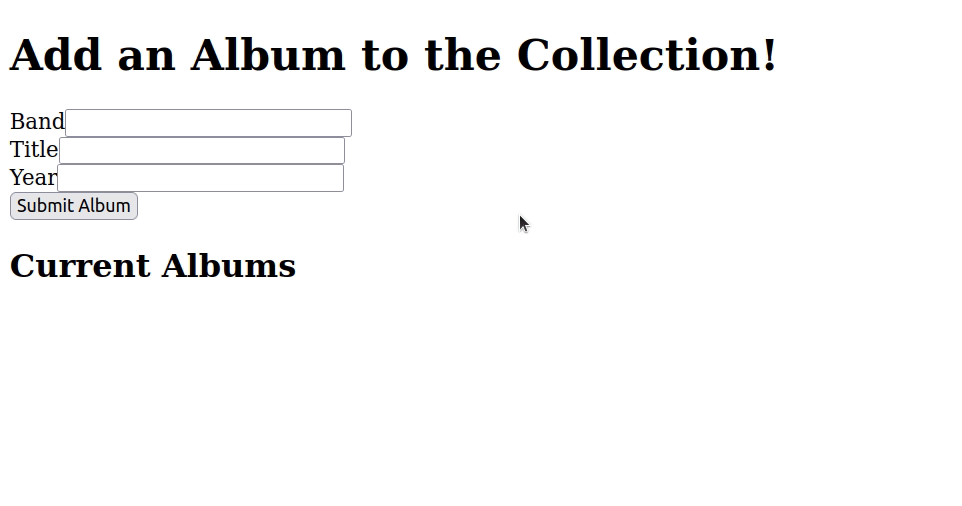

# Express - Linking a React Frontend with a Node/Express Backend - Part 2

## Instructions

1. Now, change the logic in your server's POST route. Instead of sending an album object with the response, it should instead send the **full array** of albums. 

2. Next, go to your React frontend. Create a new JSX `div` underneath your React `form`. Inside this, create a `<h2>` element with the text "Current Albums:", and an empty unordered list (`ul`) element.

3. Next, create another state variable in your React app called `albums`. This should be initialized to an empty array.

4. Using these tools, see if you can change your React app's logic, so that after you click the `Submit` button, you use the response from your server to update your JSX list of albums to show the full list of albums stored in the server (including the album the user just added!). Each album in the list should be in its own `li` element.

**Hint:** At some point using the array method **.map** may well help you with this!

## Completed Example:

